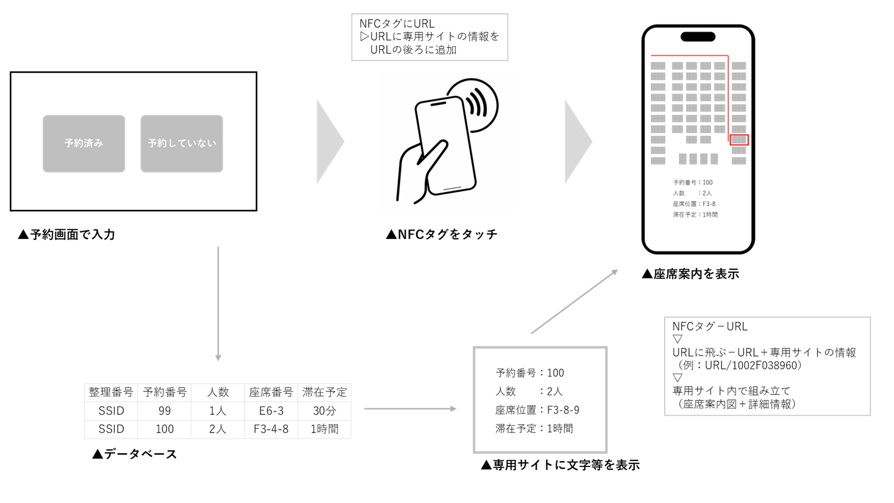
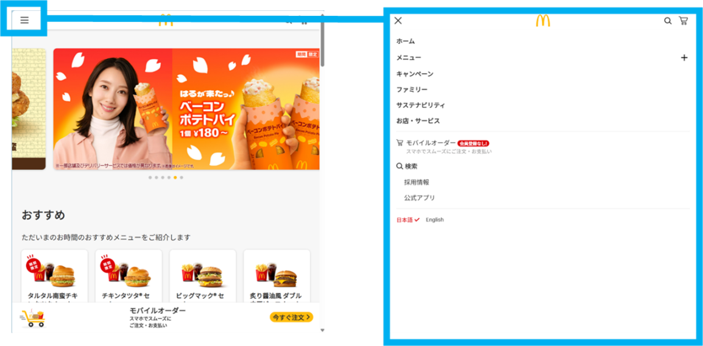

---
---

# 座席予約管理システム 要求仕様書

## 1. 概要

本システムは、施設（例：大学の共有スペース、食堂など）の座席予約および管理を効率的に行うためのウェブアプリケーションである。ユーザーはオンラインで座席の予約、変更、キャンセル、およびチェックインを行うことができる。管理者は予約状況の確認、座席管理、システム設定などを行う。システムは、予約用ユーザーサイト、チェックイン画面（端末）、管理者サイト、および各種データベースで構成される。

**主な利用者:**
- 予約ユーザー: 座席の予約および利用を希望する一般ユーザー。
- 管理者: 座席予約システムの運用・管理を行う担当者。

**システムの主な機能:**
- ユーザーによる座席の新規予約、予約変更、予約キャンセル機能。
- キャンセル待ち登録およびキャンセル発生時の自動通知・予約機能。
- QRコードを利用したチェックイン機能。
- リアルタイムでの座席空き状況確認機能。
- 管理者による予約状況の監視、座席管理、強制予約操作機能。
- 混雑状況の表示機能（ユーザー向け）。

**システムの構成要素:**
- 予約用ユーザーサイト（スマートフォン・PC対応）
- キャンセル待ち登録用ユーザーサイト（スマートフォン・PC対応）
- キャンセル待ち確定用ユーザーサイト（スマートフォン・PC対応）
- チェックイン画面/サイト（PC、専用端末を想定）
- 管理者サイト（PC対応）
- 各種データベース（座席管理、予約情報、管理者情報など）

## 2. 用語

- **予約ユーザー**: システムを利用して座席を予約した、または予約しようとしているユーザー。
- **予約していないユーザー**: システムで事前に座席を予約していないユーザー。チェックイン時に直接手続きを行う。
- **QRコード**: 予約情報やチェックイン用情報を含む二次元コード。メールで送信されたり、画面に表示されたりする。
- **予約情報**: 予約に関する詳細データ。具体的には、整理番号、人数、予約日時、滞在予定時間、メールアドレス、座席指定（該当する場合）などを含む。
- **整理番号 (UUID)**: 各予約を一意に識別するためのID。UUID (Universally Unique Identifier) の使用を想定。データベース管理用。
- **滞在予定時間**: ユーザーが座席を利用する予定の時間。例：「すぐ食べ終わる (20分)」「ゆっくり食べる (40分)」「長時間滞在予定 (1h以上)」。
- **チェックイン**: ユーザーが予約した座席、またはその場で確保した座席の利用を開始する手続き。
- **キャンセル待ち**: 希望する日時・座席が満席の場合に、空きが出た際の通知を希望するユーザーが登録する状態。
- **座席管理用データベース**: (その日の) 10分毎の座席の予約・利用状況を管理するデータベース。予約の有無に関わらず全座席情報を管理。
- **管理者ID・パスワード管理DB**: 管理者アカウントのIDとパスワードを管理するデータベース。
- **予約用ユーザーサイト**: ユーザーが座席の予約、変更、キャンセル、キャンセル待ち登録を行うためのウェブサイト。
- **チェックイン画面/サイト**: ユーザーが施設来訪時にチェックイン手続きを行うための画面または専用サイト。
- **管理者サイト**: 管理者がシステムの管理・運用を行うためのウェブサイト。
- **仮予約**: オーバーブッキングを避けるため、ユーザーが座席を選択した時点で一時的に座席を確保する状態。

## 3. 機能要件

### 3.1 ユーザー向け機能（予約用ユーザーサイト/アプリ）

-   **新規予約機能**
    -   予約情報入力機能: 利用人数、希望日時、滞在予定時間、メールアドレス、座席指定（可能な場合）などの情報を入力する。
    -   入力情報確認機能: 入力された予約情報を確認画面で表示し、必要に応じて修正のために前画面に戻れる機能（戻った際、入力済み情報は保持される）。
    -   空席確認機能: 入力された条件に基づき、座席管理用データベースを参照して予約可能な空き状況を確認する。
    -   予約確定機能: 空席が確認できた場合、予約を確定する。
    -   予約情報・QRコード送信機能: 予約確定後、予約情報（整理番号含む）とチェックイン用QRコードを、入力されたメールアドレス宛に送信する。
-   **予約変更機能**
    -   既存予約の呼び出し機能: 予約番号やメールアドレス等で既存予約を呼び出す。
    -   予約内容変更機能: 呼び出した予約の日時、人数などを変更する。
    -   変更内容確認・確定機能: 変更後の内容を確認し、確定する。空き状況も再確認する。
    -   変更後情報送信機能: 変更が確定した場合、更新された予約情報とQRコードをメールで再送信する。
-   **予約キャンセル機能**
    -   既存予約の呼び出し機能: 予約番号やメールアドレス等で既存予約を呼び出す。
    -   キャンセル実行機能: 予約をキャンセルする。
    -   キャンセル確認通知機能: キャンセルが完了したことをメールで通知する。
-   **キャンセル待ち機能**
    -   キャンセル待ち登録機能: 希望日時が満席の場合、キャンセル待ち用のメールアドレス等を入力して登録する。
    -   空き発生時URL送信機能: キャンセル等で空きが発生した場合、登録されたメールアドレス宛に予約手続き用の個別URLを送信する。
    -   予約情報確認・変更機能: 送信されたURLからアクセスし、予約情報を確認、必要であれば変更する（例：自動入力されたキャンセル待ち情報）。
    -   キャンセル待ちからの予約確定機能: 確認画面を経て予約を確定する。
    -   予約情報・QRコード送信機能（キャンセル待ち経由）: 予約確定後、予約情報とQRコードをメールで送信する。
    -   自動キャンセル機能（キャンセル待ち）: 規定時間以内に予約が確定されない場合や、希望日時を過ぎた場合には自動的にキャンセル待ち登録を無効化し、その旨をメールで通知する（キャンセル待ち空席照会中止メール）。
-   **混雑状況表示機能**
    -   リアルタイム混雑状況表示機能: 現在および指定した時間帯の混雑状況を棒グラフ等で視覚的に表示する。曜日ごとや人数ごとの表示も検討。
-   **ユーザーインターフェース・その他機能**
    -   サイトアクセス機能: URLを知っていれば誰でもアクセス可能。
    -   ナビゲーションバー機能: 新規予約、予約変更、キャンセル、混雑状況確認などの主要機能へアクセスしやすくするためのメニューバーを設ける。
    -   言語設定機能: 表示言語を日本語と英語で切り替えられる機能。

### 3.2 チェックイン機能（チェックイン画面/サイト）

-   **共通機能**
    -   設置場所: 大学生協の入口など、利用者がアクセスしやすい場所に設置。
    -   予約有無選択機能: ユーザーが「予約している」か「予約していない」かを選択する。
-   **予約済みユーザー向けチェックイン機能**
    -   QRコード読み取り機能: 事前にメールで送信された予約用QRコードを、PCのインカメラ等でスキャンする。
    -   予約情報自動入力・表示機能: QRコードから読み取った予約情報を画面に自動入力し表示する。
    -   予約情報変更機能（軽微なもの）: チェックイン時に軽微な変更（例：人数の微調整など、システムが許容する範囲で）があれば修正する。
    -   チェックイン確定・座席表示機能: 情報を確定し、割り当てられた座席位置を表示する。
-   **予約なしユーザー向けチェックイン機能**
    -   予約情報入力機能: 利用人数、希望滞在時間などの情報を入力する。
    -   入力情報確認機能: 入力情報を確認画面で表示し、必要に応じて修正のために前画面に戻れる機能（戻った際、入力済み情報は保持される）。
    -   空席確認機能: 入力された条件で現在の空席状況を確認する。
    -   チェックイン確定・座席表示機能: 空席が確認できれば情報を確定し、割り当てられた座席位置を表示する。
-   **画面設計**
    -   入力制限機能: ユーザーが管理者側の意図した情報以外を入力できないような画面設計とする。

### 3.3 管理者向け機能（管理者サイト）

-   **ログイン機能**
    -   ID・パスワード認証機能: 専用のIDとパスワードでログインする。
    -   個別ID・パスワード発行機能: 同時ログインを行うために、管理者ごとに個別のIDとパスワードを発行する。
-   **予約管理機能**
    -   予約情報一覧表示機能: 予約されている情報の一覧（日時、人数、利用者情報など）や座席情報の一覧を確認できる。
    -   座席混雑マップ表示機能: 日時を選択すると、10分ごとの座席の混雑状況をマップ形式で表示する。
    -   強制予約取消機能: 管理者が特定の予約を強制的にキャンセルする機能。キャンセル時には利用者に自動でメール通知を行う。
    -   予約受付強制停止機能: システム全体または特定時間帯の新規予約受付を一時的に停止する機能。停止中はユーザーサイトにその旨をポップアップ等で表示する。
-   **キャンセル待ち管理機能**
    -   キャンセル待ち情報一覧表示機能: キャンセル待ちに登録されているメールアドレスや希望条件の一覧を確認できる。
    -   強制取消機能（キャンセル待ち）: 管理者が特定のキャンセル待ち登録を強制的に取り消す機能。必要に応じて利用者に自動でメール通知を行う。
-   **QRコード発行システム連携**
    -   予約情報に基づいてチェックイン用QRコードを生成し、予約メールに添付して自動送信する機能（Google Chart API等の利用を想定）。
-   **システム設定機能**
    -   予約に関する各種パラメータ（予約可能期間、一予約あたりの最大人数など）を設定する。

### 3.4 データベース関連機能

-   **座席管理データベース**
    -   （その日の）10分毎の全座席の利用状況（予約済み、利用中、空きなど）を管理する。予約の有無に関わらず、施設の全座席情報を保持する。
-   **管理者ID・パスワード管理データベース**
    -   管理者アカウントのログインIDおよびハッシュ化されたパスワードを管理する。
-   **予約情報データベース**
    -   予約ごとに以下の情報を含むレコードを管理する。
        -   整理番号（UUID）
        -   利用者メールアドレス
        -   利用人数
        -   予約日時（開始・終了）
        -   滞在予定時間
        -   指定座席番号（該当する場合）
        -   予約ステータス（予約確定、キャンセル待ち、キャンセル済み、チェックイン済み、利用終了など）
        -   変更・キャンセル用整理番号/URL（必要な場合）

### 4.1 予約したユーザー

- **予約**
    1. ユーザーは、スマートフォンまたはPCから予約用ユーザーサイトにアクセスする。
    2. （任意）混雑状況表示機能で、希望日時の混雑具合を確認する。
    3. 「新規予約」機能を選択する。
    4. 利用人数、希望日時、滞在予定時間、自身のメールアドレスを入力する。（システム設定で座席指定が可能な場合は、座席も選択する）。
    5. 入力内容を確認画面で確認する。必要であれば入力画面に戻り修正する（入力内容は保持される）。
    6. 「確定」ボタンを押す。
    7. システムは、座席管理用データベースを参照し、空き状況を確認する。
    8. 空きがあれば予約を確定し、ユーザーに予約完了を画面表示する。同時に、予約情報（整理番号含む）とチェックイン時に使用するQRコードを、入力されたメールアドレス宛に自動送信する。空きがなければ、その旨を画面表示する。
- **キャンセル待ち**
    1. ユーザーは、予約用ユーザーサイトで希望日時等の予約を試みるが、満席であることを確認する。
    2. 「キャンセル待ち登録」機能を選択する。
    3. キャンセル通知を受け取るメールアドレス等を入力し、登録する。
    4. 後日、希望条件に合致するキャンセルが発生した場合、システムは登録されたメールアドレス宛に、予約手続き用の個別URLを自動送信する。
    5. ユーザーはメール内のURLをクリックし、キャンセル待ち確定用ユーザーサイトにアクセスする。
    6. 表示された予約情報（キャンセル待ち時の情報が事前入力されている）を確認し、必要であれば変更する。
    7. 確認画面を経て「予約確定」ボタンを押す（規定時間内に操作が必要）。
    8. システムは予約を確定し、予約情報とチェックイン用QRコードをメールで自動送信する。
- **予約の変更・キャンセル**
    1. ユーザーは、予約用ユーザーサイトの「予約変更・キャンセル」機能を選択する。
    2. 予約番号やメールアドレス等で該当の予約を呼び出す。
    3. 変更の場合は、希望する内容（日時、人数など）に変更し、空き状況を確認の上で確定する。変更後の予約情報とQRコードがメールで再送信される。
    4. キャンセルの場合は、「キャンセル実行」ボタンを押し、手続きを完了する。キャンセル完了の通知メールが送信される。
- **チェックイン**
    1. ユーザーは施設に来訪し、設置されているチェックイン画面/サイト（PC端末等）を操作する。
    2. 「予約している」ボタンを選択する。
    3. 事前にメールで受信したQRコードを、端末のカメラ（インカメラ等）で読み取らせる。
    4. 画面に自身の予約情報が表示されるので確認する。（必要に応じて、システムが許容する範囲で軽微な変更を行う）。
    5. 「確定」ボタンを押す。
    6. システムはチェックインを記録し、割り当てられた座席位置を画面に表示する。ユーザーは表示された座席へ向かう。

### 4.2 予約していないユーザー

- **チェックイン**
    1. ユーザーは施設に来訪し、設置されているチェックイン画面/サイト（PC端末等）を操作する。
    2. 「予約していない」ボタンを選択する。
    3. 利用人数、希望滞在時間などの必要情報を入力する。
    4. 入力内容を確認画面で確認する。
    5. 「確定」ボタンを押す。
    6. システムは現在の座席の空き状況をリアルタイムで確認する。
    7. 空席があれば、システムは座席を割り当て、チェックインを記録し、座席位置を画面に表示する。ユーザーは表示された座席へ向かう。
    8. 空席がなければ、満席である旨を画面に表示する。

### 4.3 管理者

- **予約状況の確認・管理**
    1. 管理者は、自身のPCから管理者サイトにアクセスし、専用のIDとパスワードでログインする。
    2. 「予約管理」メニューを選択する。
    3. 日時などを指定し、予約情報の一覧や座席の混雑マップを確認する。
    4. 必要に応じて、特定の予約を選択し「強制予約取消」を実行する（利用者には自動でメール通知）。
    5. 必要に応じて、「予約受付強制停止」機能で、一時的にユーザーからの予約を受け付けないように設定する。
- **キャンセル待ち状況の確認・管理**
    1. 管理者は、管理者サイトの「キャンセル待ち管理」メニューを選択する。
    2. キャンセル待ち登録されている情報の一覧を確認する。
    3. 必要に応じて、特定のキャンセル待ち登録を選択し「強制取消」を実行する。
- **システム設定の変更**
    1. 管理者は、管理者サイトの「システム設定」メニューを選択する。
    2. 予約可能な期間、一予約あたりの最大人数などのパラメータを必要に応じて変更し、設定を保存する。

## 5. 非機能要件

### 5.1 ユーザビリティ

〇 直感的で分かりやすい画面設計: アイコンと文字を効果的に使用し、ユーザーが迷わず操作できるようにする。JAL HPやマクドナルドHPのUI/UXを参考にする。
〇 入力情報の保持: 画面遷移時（例: 確認画面から入力画面へ戻る際）には、既に入力された情報を保持し、再入力の手間を省く。
〇 操作制限: ユーザー（特に一般ユーザー）がシステム管理者側の意図しない情報や操作を行えないように、入力制限や機能制限を適切に設ける。
〇 多言語対応: ユーザー向け画面は日本語および英語に対応する。

### 5.2 信頼性・正確性

〇 オーバーブッキング防止:
    - 座席選択時に仮予約（一定時間席を確保）を行い、他のユーザーとの同時予約による重複を防ぐ。これは予約変更時やキャンセル待ちからの予約確定時も同様とする。
    - 同一メールアドレスによる同一日時（前後1時間程度を含む）での重複予約を禁止する。
〇 データ整合性: 予約情報、座席情報、ユーザー情報などが常に正確にデータベースに保存・反映されること。
〇 実在メールアドレス確認（検討）: メール送信エラーを減らすため、入力されたメールアドレスの形式チェックに加え、実在性の確認（例：確認メール送信）を行うことを検討する。
〇 データベース競合防止: 複数のユーザーや管理者が同時にデータベースにアクセス・更新する際のデータ不整合や競合を防ぐための排他制御を実装する（例: トランザクション管理）。

### 5.3 セキュリティ

〇 個人情報保護:
    - ユーザーから取得する個人情報はメールアドレスのみとし、その他の個人情報は取得しない（ユーザーアカウント認証は行わない方針）。
    - メールアドレスは予約情報の送信、キャンセル待ちのお知らせ、およびシステムからの重要通知以外の目的では使用しない。
〇 DDoS攻撃対策（検討）: 大量のアクセスによるサービス停止を防ぐための対策を検討する（例: IPアドレス制限、リクエストレート制限など）。
〇 不正操作防止:
    - メールアドレス入力欄において、極端に長い文字列（例: 50文字以上）や不正なスクリプトの入力を禁止する。
〇 管理者アクセス制御: 管理者サイトへのアクセスは専用のIDとパスワードによる認証を必須とし、権限のないユーザーのアクセスを防止する。

### 5.4 性能

〇 リアルタイム処理: 座席の空き状況確認、予約処理、チェックイン処理はリアルタイムまたはそれに近い応答速度で行われること。
〇 大量アクセス対応: ピーク時など、多数の同時アクセスが発生した場合でも、システムの応答性が著しく低下しないようにする。

### 5.5 運用・保守性

〇 管理者複数ログイン対応: 複数の管理者が同時に管理者サイトにログインして作業できること。
〇 QRコード自動化: 予約確定時や変更時に、QRコードを自動で生成し、メールに添付して送信する。

### 5.6 その他

〇 キャンセル待ち処理: キャンセル待ちが複数人いる場合、登録順やその他の優先順位に基づいて公平に処理することを考慮する。キャンセル待ち用のメールアドレスも予約情報として適切に管理する。
〇 予約不可状態でのキャンセル待ち: すでに予約を持っているユーザーは、同一施設・時間帯での新たなキャンセル待ち登録を不可とする。

## 6. 実装候補の機能要件

本セクションでは、現行の必須要件には含まれていないものの、PDF資料内で言及されており、将来的なシステムの拡張や利便性向上、特定の運用ニーズに対応するために実装が検討される可能性のある機能要件の候補を挙げます。これらの機能の採用優先度や詳細仕様については、今後の検討課題とします。

- **NFCタグによる座席案内機能**
    1.  チェックイン端末で、予約済みか予約していないかを選択すると同時に、データベースに新たなレコード枠（チェックイン情報）を追加する。
    2.  リアルタイムで最新のレコード（予約番号・人数・座席配置・滞在予定 etc.）を（NFC連携用の）専用サイトに表示する。
    3.  チェックイン端末付近に設置されたNFCタグから、スマートフォンで静的URLを読み取る。
        -   URL内に、そのURLの後ろに追加するための文字列（専用サイトの情報から作成）を埋め込み、動的に座席案内用URLを生成して遷移する。
    4.  遷移先の座席案内用URL内で、URL後部の文字列情報をもとに、個別の座席への案内図や座席情報を表示する。

    

- **混雑状況（ユーザー画面）**
    -   **表示位置:** 新規予約・予約変更・キャンセル機能と同じ予約用ユーザーサイト画面の上部などに混雑状況表示エリアを配置することを検討。
    -   **表示方法:**
        -   混雑状況を棒グラフ等で視覚的に表示する。
        -   参考: Google Map のような時間帯別混雑表示。
        -   表示粒度: 曜日ごとではなく、**利用人数ごと**の混雑状況表示を検討。

    

    -   **実装の仕組み（案）:**
        1.  座席管理用データベースの情報をリアルタイムに集計し、人数ごと・1時間ごとの埋まり具合を示す「混雑状況用データベース（またはビュー）」を（仮想的に）作成する。
        2.  混雑状況用データベースの情報をもとに、棒グラフなどの形式でWeb上に表示する。

- **メニューバー（ユーザー画面）**
    -   **現状と導入検討:**
        -   現在のユーザー画面は、新規予約・予約変更・キャンセル機能が中心の単一ページ構成に近い。
        -   より多くの機能へのアクセスを提供するため、ナビゲーション用のメニューバーの導入を検討。
        -   参考: マクドナルドHPなどのメニューバー構成。

    

    -   **メニューバーの内容候補:**
        -   **予約関連:**
            -   新規予約
            -   予約変更・キャンセル
            -   （JAL予約システムのようなナビゲーションを参考）
        -   **混雑状況・予想:**
            -   現在の混雑状況（人数別グラフ表示）
            -   今後の混雑予想（詳細表示へのリンク）
        -   **空席検索:**
            -   その日の空席状況（座席混雑度マップ表示、10分ごと）
        -   **メニュー情報:**
            -   今日のメニュー一覧表示
            -   （参考: マクドナルド公式メニュー）
        -   **店舗情報:**
            -   営業時間（大生協、厚生棟など施設ごと）
            -   大学MAP（既存のものを利用）
        -   **言語設定:** 日本語 / 英語 切り替え

    -   **機能詳細（候補）:**
        -   **混雑状況・予想（詳細）:**
            -   現在の混雑状況: 予約画面上部と同様の人数別グラフを表示。
            -   今後の混雑予想:
                -   大学の授業カレンダー等と連携し、予約数や過去の利用実績データも加味して予測する機能を検討。
                -   算出ロジック: 曜日、講義数、時間帯、過去の座席利用状況などを基に算出。
                -   新たに必要なデータベース（検討）:
                    -   大学の授業日カレンダー
                    -   大学の曜日ごとの講義数・講義教室・受講者数（シラバス等からの自動取得可能性を検討）
                    -   過去の座席利用状況（曜日ごと・人数ごと）
        -   **空席検索（詳細）:**
            -   その日の空席状況: 座席混雑度マップ形式で表示（10分ごとの更新）。
        -   **メニュー情報（詳細）:**
            -   表示内容: 大学生協などの今日のメニュー一覧。写真、値段、カロリー、名前等を表示。
            -   更新方法: 管理者が管理画面の選択リスト（selectタグ等）で毎日更新できる仕組み。
            -   新たに必要なデータベース（検討）:
                -   メニュー一覧データベース（商品名、価格、画像パス、カロリー等）
        -   **店舗情報（詳細）:**
            -   表示内容: 各施設の営業時間、大学MAP（既存のものを利用）。
            -   更新方法: 営業時間は管理者画面でデータベースを管理。
            -   新たに必要なデータベース（検討）:
                -   営業時間データベース
